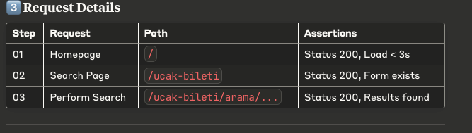
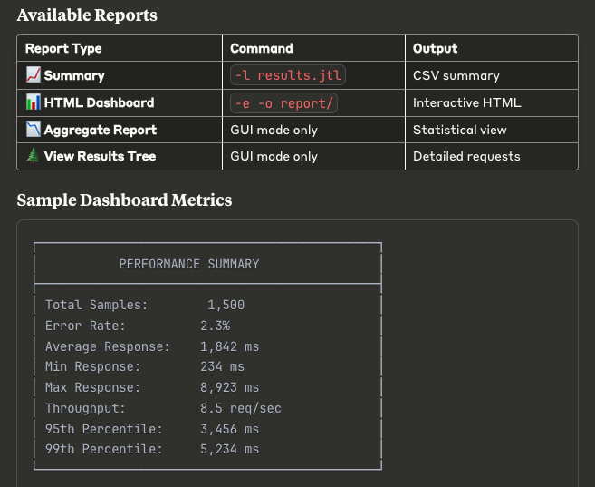

# 🚀 Enuygun.com Flight Search Load Testing Suite

Professional **Apache JMeter** test suite for load testing **Enuygun.com's flight search functionality** with **Cloudflare bypass support** and **comprehensive reporting**.

---

## ✨ Features

- ✅ **Cloudflare Protection Bypass** – Automated cookie handling
- ✅ **Realistic User Simulation** – Human-like behavior patterns
- ✅ **Comprehensive Reporting** – HTML, CSV, and Dashboard reports
- ✅ **Parameterized Testing** – Dynamic date and route selection
- ✅ **Error Handling** – Robust assertion and validation
- ✅ **CI/CD Ready** – Command-line execution support

---

## 📋 Prerequisites

Ensure you have the following installed:

```
# Check Java installation (Required: Java 8+)
java -version

# Download and install JMeter
wget https://archive.apache.org/dist/jmeter/binaries/apache-jmeter-5.6.3.tgz
tar -xzf apache-jmeter-5.6.3.tgz
cd apache-jmeter-5.6.3

# Set environment variables
export JMETER_HOME=$(pwd)
export PATH=$PATH:$JMETER_HOME/bin

🏃‍♂️ Running Your First Test
jmeter -n -t enuygun-flight-search.jmx -l results.jtl

2. With HTML report generation
jmeter -n -t enuygun-flight-search.jmx -l results.jtl -e -o report/

jmeter -g results.jtl -o dashboard/
```



